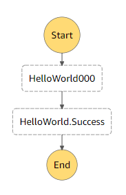

Stepper
====

Stepper to Step Functions = High level language to Assembly.
 
By using Stepper, you can write Step Functions with modern programming constructs such as `if else` branching, `for` 
and `while` loops, `try catch` for error handling and natural expressions such as `a = arr.length + 1`. 
To illustrate, lets create a step-function that generates the first 10 Fibonnaci numbers and stores them into an SQS 
queue. The first two values of the series are hardcoded and the rest of the series is then generated. 

```Javascript

@Comment("Generate Fibonnaci numbers")
@TimeoutSeconds(120)
@Version("1.0")
stepper Fibonnaci {
	// first two fibonnaci are static
	 task {
        "Resource": "arn:aws:states:::sqs:sendMessage",
      	"Parameters": {
        	"MessageBody": "0",
        	"QueueUrl": "https://sqs.us-east-1.amazonaws.com/1570xxx/fibo"
      	}
    }
	task {
        "Resource": "arn:aws:states:::sqs:sendMessage",
      	"Parameters": {
        	"MessageBody": "1",
        	"QueueUrl": "https://sqs.us-east-1.amazonaws.com/1570xxx/fibo"
      	}
    }
	previous = 0;
	current = 1;
	count = 2;
	while (count < 10) {
		fib = previous + current;
		previous = current;
		current = fib;
		entry = fib + "";
		// write to queue
		sqs = task {
            "Resource": "arn:aws:states:::sqs:sendMessage",
	      	"Parameters": {
	        	"MessageBody.$": "$.entry",
	        	"QueueUrl": "https://sqs.us-east-1.amazonaws.com/1570xxx/fibo"
	      	}
        }
        count = count + 1;
	}
}

```
   
Stepper will compile the code above into the following Step Function state machine.

<details>
    <summary>JSON for Fibonnaci step function
        ```json
        {
          "Comment": "Generate Fibonnaci numbers",
          "TimeoutSeconds": 120,
          "Version": "1.0",
          "StartAt": "Fibonnaci000",
        ```
    </summary>
    
```json
{
  "Comment": "Generate Fibonnaci numbers",
  "TimeoutSeconds": 120,
  "Version": "1.0",
  "StartAt": "Fibonnaci000",
  "States": {
    "Fibonnaci000": {
      "Type": "Task",
      "Resource": "arn:aws:states:::sqs:sendMessage",
      "Parameters": {
        "MessageBody": "0",
        "QueueUrl": "https://sqs.us-east-1.amazonaws.com/1570xxx/fibo"
      },
      "ResultPath": "$.Fibonnaci000",
      "Next": "Fibonnaci001"
    },
    "Fibonnaci001": {
      "Type": "Task",
      "Resource": "arn:aws:states:::sqs:sendMessage",
      "Parameters": {
        "MessageBody": "1",
        "QueueUrl": "https://sqs.us-east-1.amazonaws.com/1570xxx/fibo"
      },
      "ResultPath": "$.Fibonnaci001",
      "Next": "Fibonnaci002"
    },
    "Fibonnaci002": {
      "Type": "Pass",
      "Result": 0,
      "ResultPath": "$.previous",
      "Next": "Fibonnaci003"
    },
    "Fibonnaci003": {
      "Type": "Pass",
      "Result": 1,
      "ResultPath": "$.current",
      "Next": "Fibonnaci004"
    },
    "Fibonnaci004": {
      "Type": "Pass",
      "Result": 2,
      "ResultPath": "$.count",
      "Next": "Fibonnaci005"
    },
    "Fibonnaci005": {
      "Type": "Task",
      "Parameters": {
        "cmd__sm": "Fibonnaci005",
        "count.$": "$.count"
      },
      "Resource": "arn:aws:lambda:us-east-1:1570xxx:function:Fibonnaci_stepperLambda",
      "ResultPath": "$.Fibonnacivar__000",
      "Next": "Fibonnaci006"
    },
    "Fibonnaci006": {
      "Type": "Choice",
      "Choices": [
        {
          "Variable": "$.Fibonnacivar__000",
          "BooleanEquals": true,
          "Next": "Fibonnaci007"
        },
        {
          "Variable": "$.Fibonnacivar__000",
          "BooleanEquals": false,
          "Next": "Fibonnaci.Success"
        }
      ]
    },
    "Fibonnaci007": {
      "Type": "Task",
      "Parameters": {
        "cmd__sm": "Fibonnaci007",
        "current.$": "$.current",
        "previous.$": "$.previous"
      },
      "ResultPath": "$.fib",
      "Resource": "arn:aws:lambda:us-east-1:1570xxx:function:Fibonnaci_stepperLambda",
      "Next": "Fibonnaci008"
    },
    "Fibonnaci008": {
      "Type": "Task",
      "Parameters": {
        "cmd__sm": "Fibonnaci008",
        "current.$": "$.current"
      },
      "ResultPath": "$.previous",
      "Resource": "arn:aws:lambda:us-east-1:1570xxx:function:Fibonnaci_stepperLambda",
      "Next": "Fibonnaci009"
    },
    "Fibonnaci009": {
      "Type": "Task",
      "Parameters": {
        "cmd__sm": "Fibonnaci009",
        "fib.$": "$.fib"
      },
      "ResultPath": "$.current",
      "Resource": "arn:aws:lambda:us-east-1:1570xxx:function:Fibonnaci_stepperLambda",
      "Next": "Fibonnaci010"
    },
    "Fibonnaci010": {
      "Type": "Task",
      "Parameters": {
        "cmd__sm": "Fibonnaci010",
        "fib.$": "$.fib"
      },
      "ResultPath": "$.entry",
      "Resource": "arn:aws:lambda:us-east-1:1570xxx:function:Fibonnaci_stepperLambda",
      "Next": "Fibonnaci011"
    },
    "Fibonnaci011": {
      "Type": "Task",
      "Resource": "arn:aws:states:::sqs:sendMessage",
      "Parameters": {
        "MessageBody.$": "$.entry",
        "QueueUrl": "https://sqs.us-east-1.amazonaws.com/1570xxx/fibo"
      },
      "ResultPath": "$.sqs",
      "Next": "Fibonnaci012"
    },
    "Fibonnaci012": {
      "Type": "Task",
      "Next": "Fibonnaci005",
      "Parameters": {
        "cmd__sm": "Fibonnaci012",
        "count.$": "$.count"
      },
      "ResultPath": "$.count",
      "Resource": "arn:aws:lambda:us-east-1:1570xxx:function:Fibonnaci_stepperLambda"
    },
    "Fibonnaci.Success": {
      "Type": "Succeed"
    }
  }
}
```
</details>




The ASL produced has a placeholder `Resource` reference for the Lambda helper required. In a future release
the lambda could be auto-registered and the arn populated. For now, the framework produces the lambda code
as shown below and you have to register and populate the reference. 

```Javascript

exports.handler = async (event) => {

        if (event.cmd__sm == "state001") {

            var array1 = event.array1;

            const response = array1.length>=5;
            return response;
        }

        if (event.cmd__sm == "state003") {

            var array1 = event.array1;

            const response = array1[array1.length/2].toUpperCase();
            return response;
        }

        if (event.cmd__sm == "state005") {

            var array1 = event.array1;

            const response = array1[0].toUpperCase();
            return response;
        }

    else return {"error": "no branch matched"};
};


```
The code is at `0.1-SNAPSHOT` version and currently only supports `tasks`, `if` statement and assignment expressions. 
The plan is to add the following features for the 1.0 release:

* control structures
    - `while`, `for` control statements
    - iterator for collections
    - `switch` with patttern matching
* `task` state name control
* `wait` and other state types.
* `parallel` task execution 

It would be great to see Stepper grow to a point where it is supported natively in State Functions. 
This will allow even more advanced constructs (dynamic number of parallel tasks for example).

Getting Started
---
     
In the very crude 0.1 version, clone and build the code using gradle. Run `com.eclecticlogic.stepper.Stepper` as your 
main Java class and pass in a reference to the file containing your stepper language. The ASL and supporting 
json will be printed to console.

Next Steps
---

* Unit tests for stepper language grammar
* Release to maven repo
* Create executable jar
* Add support for language constructs to achieve 1.0 release. 