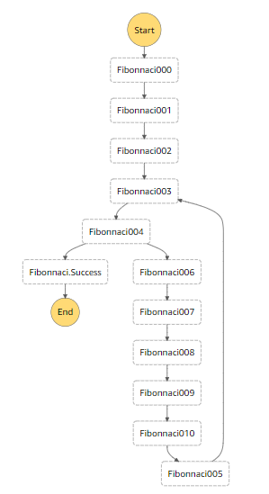

Stepper
====

Stepper to Step Functions = High level language to Assembly.
 
Stepper allows you to write AWS Step Functions using modern programming constructs such as `if else` branching, `for` 
and `while` loops, `try catch` for error handling and natural expressions such as `a = arr.length + 1`. 
To illustrate, let us create a step function that generates the first 10 Fibonnaci numbers and stores them into an SQS 
queue. The first two values of the series are hardcoded and the rest of the series is then computed. 

```Javascript

@Comment("Generate Fibonnaci numbers")
@TimeoutSeconds(120)
@Version("1.0")
stepper Fibonnaci {
    // first two fibonnaci are static
    task {
        "Resource": "arn:aws:states:::sqs:sendMessage",
        "Parameters": {
            "MessageBody": "0",
            "QueueUrl": "https://sqs.us-east-1.amazonaws.com/1570xxx/fibo"
        }
    }
    task {
        "Resource": "arn:aws:states:::sqs:sendMessage",
        "Parameters": {
            "MessageBody": "1",
            "QueueUrl": "https://sqs.us-east-1.amazonaws.com/1570xxx/fibo"
        }
    }

    previous = 0;
    current = 1;
    count = 2;
    while (count < 10) {
        fib = previous + current;
        previous = current;
        current = fib;
        entry = fib + "";
        // write to queue
        sqs = task {
            "Resource": "arn:aws:states:::sqs:sendMessage",
            "Parameters": {
                "MessageBody.$": "$.entry",
                "QueueUrl": "https://sqs.us-east-1.amazonaws.com/1570xxx/fibo"
            }
        }
        count = count + 1;
    }
}

```
   
As you can see, the above code feels like a modern programming language (Stepper seeks compatibility with Javascript 
expression syntax and built-in functions). The Stepper compiler turns the variables used into ASL json attributes and 
then creates a supporting Lambda function to evaluate expressions used. Stepper will compile the code above into the 
following state machine.

<details>
    <summary>JSON for Fibonnaci step function ... (click to expand).</summary>
    
```json
{
  "Comment": "Generate Fibonnaci numbers",
  "TimeoutSeconds": 120,
  "Version": "1.0",
  "StartAt": "Fibonnaci000",
  "States": {
    "Fibonnaci000": {
      "Type": "Task",
      "Resource": "arn:aws:states:::sqs:sendMessage",
      "Parameters": {
        "MessageBody": "0",
        "QueueUrl": "https://sqs.us-east-1.amazonaws.com/1570xxx/fibo"
      },
      "ResultPath": "$.Fibonnaci000",
      "Next": "Fibonnaci001"
    },
    "Fibonnaci001": {
      "Type": "Task",
      "Resource": "arn:aws:states:::sqs:sendMessage",
      "Parameters": {
        "MessageBody": "1",
        "QueueUrl": "https://sqs.us-east-1.amazonaws.com/1570xxx/fibo"
      },
      "ResultPath": "$.Fibonnaci001",
      "Next": "Fibonnaci002"
    },
    "Fibonnaci002": {
      "Type": "Pass",
      "Result": 0,
      "ResultPath": "$.previous",
      "Next": "Fibonnaci003"
    },
    "Fibonnaci003": {
      "Type": "Pass",
      "Result": 1,
      "ResultPath": "$.current",
      "Next": "Fibonnaci004"
    },
    "Fibonnaci004": {
      "Type": "Pass",
      "Result": 2,
      "ResultPath": "$.count",
      "Next": "Fibonnaci005"
    },
    "Fibonnaci005": {
      "Type": "Task",
      "Parameters": {
        "cmd__sm": "Fibonnaci005",
        "count.$": "$.count"
      },
      "Resource": "arn:aws:lambda:us-east-1:1570xxx:function:Fibonnaci_stepperLambda",
      "ResultPath": "$.Fibonnacivar__000",
      "Next": "Fibonnaci006"
    },
    "Fibonnaci006": {
      "Type": "Choice",
      "Choices": [
        {
          "Variable": "$.Fibonnacivar__000",
          "BooleanEquals": true,
          "Next": "Fibonnaci007"
        },
        {
          "Variable": "$.Fibonnacivar__000",
          "BooleanEquals": false,
          "Next": "Fibonnaci.Success"
        }
      ]
    },
    "Fibonnaci007": {
      "Type": "Task",
      "Parameters": {
        "cmd__sm": "Fibonnaci007",
        "current.$": "$.current",
        "previous.$": "$.previous"
      },
      "ResultPath": "$.fib",
      "Resource": "arn:aws:lambda:us-east-1:1570xxx:function:Fibonnaci_stepperLambda",
      "Next": "Fibonnaci008"
    },
    "Fibonnaci008": {
      "Type": "Task",
      "Parameters": {
        "cmd__sm": "Fibonnaci008",
        "current.$": "$.current"
      },
      "ResultPath": "$.previous",
      "Resource": "arn:aws:lambda:us-east-1:1570xxx:function:Fibonnaci_stepperLambda",
      "Next": "Fibonnaci009"
    },
    "Fibonnaci009": {
      "Type": "Task",
      "Parameters": {
        "cmd__sm": "Fibonnaci009",
        "fib.$": "$.fib"
      },
      "ResultPath": "$.current",
      "Resource": "arn:aws:lambda:us-east-1:1570xxx:function:Fibonnaci_stepperLambda",
      "Next": "Fibonnaci010"
    },
    "Fibonnaci010": {
      "Type": "Task",
      "Parameters": {
        "cmd__sm": "Fibonnaci010",
        "fib.$": "$.fib"
      },
      "ResultPath": "$.entry",
      "Resource": "arn:aws:lambda:us-east-1:1570xxx:function:Fibonnaci_stepperLambda",
      "Next": "Fibonnaci011"
    },
    "Fibonnaci011": {
      "Type": "Task",
      "Resource": "arn:aws:states:::sqs:sendMessage",
      "Parameters": {
        "MessageBody.$": "$.entry",
        "QueueUrl": "https://sqs.us-east-1.amazonaws.com/1570xxx/fibo"
      },
      "ResultPath": "$.sqs",
      "Next": "Fibonnaci012"
    },
    "Fibonnaci012": {
      "Type": "Task",
      "Next": "Fibonnaci005",
      "Parameters": {
        "cmd__sm": "Fibonnaci012",
        "count.$": "$.count"
      },
      "ResultPath": "$.count",
      "Resource": "arn:aws:lambda:us-east-1:1570xxx:function:Fibonnaci_stepperLambda"
    },
    "Fibonnaci.Success": {
      "Type": "Succeed"
    }
  }
}
```
</details>



Stepper can automatically register the Lambda and create the Step Function or it can output the code for those pieces 
and you can manually register them. Stepper supports:

- variable assignments and expressions
- if/else branching
- for loops over range with step and looping over collections
- while loops
- "when" which is a variation of the traditional switch statement for multi-predicate branching
- task ASL state for calling activities, accessing queues, etc. 
- wait and fail construct
- annotation driven retry logic
- control over state names
- parallel state that simply includes other stepper programs to be run concurrently
- goto statement for complex logic
- try/catch construct for error handling.

To learn how to get started with Stepper, head over to the Getting Started page of the wiki. The language reference is
also accessible from the wiki pages. 
